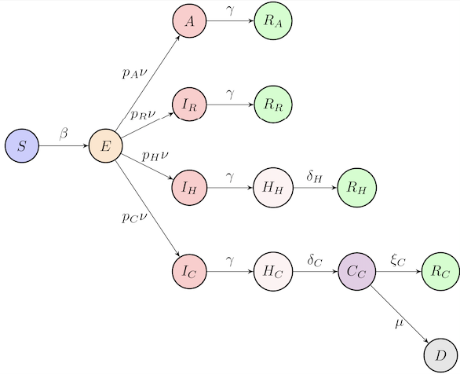
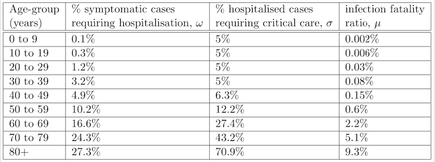

In this app we use an SEIR-type model of COVID-19 with account for: 

* **non-exponentia**l distribution of incubation and recovery periods;
* **age structure** of the population (allows to include more accurate data on age-specific rates of hospitalisation and COVID-19 related mortality).


in order to obtain more accurate estimates of disease progression and investigate different strategies for 

* **introducing** quarantine/lockdown;
* **lifting** quarantine/lockdown.

Full details of the model and its analysis are presented in (1) (**References** are at the bottom of this page).

We model the disease dynamics as follows: 

* **Susceptibles** (${\color{blue}S}$) get exposed to the disease and

* after acquiring the infection at rate ${\color{blue}\beta}$ from infected individuals, they move to 

* **Exposed** (${\color{blue}E}$) class, stay there for an incubation period ${\color{blue}{1/\nu}}$ before 

* becoming infective (either symptomatically or asymptomatically), at which point a proportion ${\color{blue}{p_A}}$ of them will **move** into 
 + **Asymptomatic** infected (${\color{blue}A}$), 
 + a proportion ${\color{blue}{p_R}}$ will move into **Infected with mild symptoms** (${\color{blue}{I_{R}}}$) not needing hospital and proceeding directly to **recovery** (${\color{blue}{R_{R}}}$)
 + a proportion ${\color{blue}{p_H}}$ will move into a class who will **need hospital** treatment (${\color{blue}{I_{H}}}$), 
 + a proportion ${\color{blue}{p_C}}$ will move into a class of those who will **need critical care** (${\color{blue}{I_{C}}}$). 

_Note: incubation period, which is the time from infection to the onset of symptoms, is taken to be the same as the latent period, which is the time from infection to becoming infectious._ 

* After recovery, characterised by an **average recovery period** ${\color{blue}{1/\gamma}}$, **Asymptomatic** individuals move into the **Recovered** class (${\color{blue}{R_{A}}}$);

* individuals in the ${\color{blue}{I_{R}}}$ group **move** into the ${\color{blue}{R_{R}}}$ class upon recovery. 

* Those who are **infected** and **require hospitalisation** move into 
 + class ${\color{blue}{H_{H}}}$ and then proceed to the 
 **Recovered** class ${\color{blue}{R_{H}}}$ after an average period of ${\color{blue}{1/\delta_{H}}}$.
 
 
* The **infected** require **critical care** ${\color{blue}{I_{C}}}$ move into 
 +  **hospitalised** class ${\color{blue}{H_{C}}}$, from which they proceed to 
 + a **critical care** class ${\color{blue}{C_C}}$ at rate ${\color{blue}{\delta_{C}}}$;
 + and subsequently they either move into 
 + the **recovered** class ${\color{blue}{R_{C}}}$ at rate ${\color{blue}{\xi_{C}}}$, 
 + or die and move to a compartment ${\color{blue}D}$ at rate ${\color{blue}\mu}$. 
 
* To include the **distributions of incubation and recovery periods** in the model, we assume that with the same mean incubation period, individuals in the **Exposed** class go through ${\color{blue}{K_1}}$ sequential stages of equal duration, and in the **Asymptomatic** and **Infected** classes they go through ${\color{blue}{K_2}}$ stages of the same duration.

* Each of the compartments is further subdivided in **18 age groups** 0-4, 5-9, ... , 85+, with population distributions for different regions taken from the data compiled by the Office for National Statistics (2). Interactions between different age groups are determined by the **mixing matrix** ${\color{blue}{C_{ij}}}$ taken as the BBC-all matrix (3,4) for baseline, and the CoMix-all matrix (5) for lockdown.

### Model Equations

$${\color{blue}{\dot{S}^i}}=-\beta S^i\sum_{j=1}^{18}\sum_{k=1}^{K_2}(I^j_{k,R}+I^j_{k,H}+I^j_{k,C}+A^j_k)/N^j,$$
$${\color{blue}{\dot{E}_{1}^i}}=\beta S^i\sum_{j=1}^{18}\sum_{k=1}^{K_2}(I^j_{k,R}+I^j_{k,H}+I^j_{k,C}+A^j_k)/N^j-K_1\nu E_{1}^i,$$
$${\color{blue}{\dot{E}_{2}^i}}=K_1\nu E_{1}^i-K_1\nu E_{2}^i, \quad\ldots, \quad{\color{blue}{\dot{E}_{K_1}^i}}=K_1\nu E_{K_1-1}^i-K_1\nu E_{K_1}^i,$$
$${\color{blue}{\dot{A}_{1}^i}}=p_{A}K_1\nu E_{K_1}^i-K_2\gamma A_1^i, \quad\ldots, \quad {\color{blue}{\dot{A}_{K_2}^i}}=K_2\gamma A_{K_2-1}^i-K_2\gamma A_{K_2}^i,$$
$${\color{blue}{\dot{I}_{1,R}^i}}=p_{R}^iK_1\nu E_{K_1}^i-K_2\gamma I_{1,R}^i,\quad\ldots, \quad {\color{blue}{\dot{I}_{K_2,R}^i}}=K_2\gamma I_{K_2-1,R}^i-K_2\gamma I_{K_2,R}^i,$$
$${\color{blue}{\dot{I}_{1,H}^i}}=p_{H}^iK_1\nu E_{K_1}^i-K_2\gamma I_{1,H}^i,\quad\ldots, \quad {\color{blue}{\dot{I}_{K_2,H}^i}}=K_2\gamma I_{K_2-1,H}^i-K_2\gamma I_{K_2,H}^i,$$
$${\color{blue}{\dot{I}_{1,C}^i}}=p_{C}^iK_1\nu E_{K_1}^i-K_2\gamma I_{1,C}^i,\quad\ldots, \quad {\color{blue}{\dot{I}_{K_2,C}^i}}=K_2\gamma I_{K_2-1,C}^i-K_2\gamma I_{K_2,C}^i,$$
$${\color{blue}{\dot{H}_{H}^i}}=K_2\gamma I_{K_2,H}^i-\delta_{H} H_{H}^i, \qquad {\color{blue}{\dot{H}_{C}^i}}=K_2\gamma I_{K_2,C}^i-\delta_{C} H_{C}^i,$$
$${\color{blue}{\dot{C}_{C}^i}}=\delta_{C} H_{C}^i-(\xi_{C}+\mu) C_{C}^i,\qquad  {\color{blue}{\dot{R}_{A}^i}}=K_2\gamma A_{K_2}, \qquad {\color{blue}{\dot{R}_{R}^i}}=K_2\gamma I_{K_2,R}^i,$$
$${\color{blue}{\dot{R}_{H}^i}}=\delta_{H}H_{H}^i,\qquad {\color{blue}{\dot{R}_{C}^i}}=\xi_{C}C_{C}^i,\qquad {\color{blue}{\dot{D}^i}}=\mu^i C_{C}^i,$$

where

$${\color{blue}{p_{H}^i}}={\color{red}\omega^i}(1-p_{A})(1-{\color{red}\sigma^i}),$$
$${\color{blue}{p_{C}^i}}={\color{red}\sigma^i} {\color{red}\omega^i} (1-p_{A}),$$
$${\color{blue}{p_{R}^i}}=(1-p_{A})(1-{\color{red}\omega^i}).$$
Here

* ${\color{red}\omega^i}$ is the rate of hospitalisation;
* ${\color{red}\sigma^i}$ is the rate of critical care admission.

### Parameters - Values - Meaning

* ${\color{blue}{\beta}}$ - ${\color{red}{0.15}}$ - disease transmission/infection rate;

* ${\color{blue}{{K_{1}}}}$, ${\color{blue}{{K_{2}}}}$ - ${\color{red}6, {varies}}$ - number of exposed and recovery stages;

* ${\color{blue}{1/ \nu}}$  - ${\color{red}{5 \mbox{ } days}}$ - incubation time;

* ${\color{blue}{1/\gamma}}$ - ${\color{red}{16.6 \mbox{ } days}}$ - infectious period/time to hospitalisation (both non-critical and critical care);

* ${\color{blue}{p_{A}}}$ - ${\color{red}{0.5, \mbox{ } (varies)}}$ -  proportion of asymptomatic infections;

* ${\color{blue}{p_{R}}}$ - proportion of mild symptomatic infections without the hospital/critical care requirements;

* ${\color{blue}{p_{H}}}$ - proportion of symptomatic infections requiring hospitalisation, but not critical care;

* ${\color{blue}{p_{C}}}$ - proportion of symptomatic infections requiring critical care;

* ${\color{blue}{1/\delta_{H}}}$  - ${\color{red}{8 \mbox{ } days}}$ - recovery time for non-critical hospital cases;

* ${\color{blue}{1/\delta_{C}}}$  - ${\color{red}{8 \mbox{ } days}}$ - average duration from hospital admission to requiring critical care;

* ${\color{blue}{1/\xi_{C}}}$  - ${\color{red}{10 \mbox{ } days}}$ - recovery time for admissions requiring critical care;

* ${\color{blue}{\mu}}$ - mortality rate for admissions requiring critical care.

Baseline values of these parameters are taken from (6), except for ${\color{blue}{1/\gamma}}$ and $K_1$ from (7), and ${\color{blue}{\beta}}$ adjusted to have the baseline value of ${\color{blue}{R_0=2.5}}$.

Age-specific values for ${\color{blue}{\omega}}$, ${\color{blue}{\sigma}}$ and ${\color{blue}{\mu}}$ are given by the following table (see (8) )



### Variables - Meaning

There are **18 age classes**, and in each of these classes people are divided into the following compartments

* ${\color{blue}{S}}$ - Susceptibles;

* ${\color{blue}{N}}$ - Total population size;

* ${\color{blue}{E_{i}}}$, ${i}=1,...,K_1$ - Exposed individuals in different stages after the exposure to the disease;

* ${\color{blue}{A_i}}$, ${i}=1,...,K_2$ - Asymptomatic infected individuals in different stages;

* ${\color{blue}{I_{R,i}}}$, ${i}=1,...,K_2$ - Infected individuals in different stages, who will not require hospitalisation;

* ${\color{blue}{I_{H,i}}}$, ${i}=1,...,K_2$ - Infected individuals in different stages, who will require hospitalisation;

* ${\color{blue}{I_{C,i}}}$, ${i}=1,...,K_2$ - Infected individuals in different stages, who will require hospitalisation followed by critical care;

* ${\color{blue}{H_{H}}}$ - Hospitalised individuals not requiring critical care;

* ${\color{blue}{H_{C}}}$ - Hospitalised individuals requiring critical care;

* ${\color{blue}{C_{C}}}$ - Individuals in critical care;

* ${\color{blue}{R_{A}}}$ - Recovered asymptomatic individuals;

* ${\color{blue}{R_{R}}}$ - Recovered individuals without hospitalisation;

* ${\color{blue}{R_{H}}}$ - Recovered individuals after hospital (without critical care) admission;

* ${\color{blue}{R_{C}}}$ - Recovered individuals after critical care;

* ${\color{blue}{D}}$ - Those who died in critical care.


### Relating clinical observations to model parameters

To determine the model parameters consistent with current clinical data, we collect the following values from the slider values chosen by the user, and then use the formulas below to relate them to the rate parameters in the model. Note that the slider inputs for time intervals are average durations. 

* IncubPeriod:  Average incubation period, days
* RecovPeriod: Average recovery period, days
* FracAsym: Fraction of asymptomatic infections
* HospRecPer: Duration of hospital recovery for non-critical cases, days
* CritProg: Time to progress to critical care in hospital, days
* CritRec: Time to recover from critical care, days
* beta: Transmission rate

(Note g=$\gamma$, dh=$\delta_H$, dc=$\delta_C$, xic=$\xi_C$, pa=$p_A$)
```{r}
    nu=1/IncubPeriod
    
    g=1/RecovPeriod
    
    dh=1/HospRecPer
    
    dc=1/CritProg
    
    xic=1/CritRec
    
    pa=FracAsym
```


### References

* (1) K.B. Blyuss, Y.N. Kyrychko, Effects of latency and age structure on the dynamics of COVID-19, (2020) [medRxiv](https://www.medrxiv.org/content/10.1101/2020.04.25.20079848v1)
* (2) Office for National Statistics, 2018 Mid-year population estimates (2019).
* (3) P. Klepac, S. Kissler, J. Gog, Contagion! The BBC Four Pandemic The model behind the documentary,
*Epidemics* **24**, 49-59 (2018).
* (4) P. Klepac, A.J. Kucharski, A.J.K. Conlan, S. Kissler, M. Tang, H. Fry, J.R. Gog, Contacts in context:
large-scale setting-specific social mixing matrices from the BBC Pandemic project, (2020) [medRxiv](https://www.medrxiv.org/content/10.1101/2020.02.16.20023754v1)
* (5) C. Jarvis et al., Quantifying the impact of physical distance measures on the transmission of COVID-19 in the UK, (2020) [medRxiv](https://doi.org/10.1101/2020.03.31.20049023)
* (6) S.M. Kissler, C. Tedijanto, E. Goldstein, Y.H. Grad, M. Lipsitch, Projecting the transmission dynamics
of SARS-CoV-2 through the postpandemic period, *Science* (2020) [online](https://doi.org/10.1126/science.abb5793)
* (7) S.A. Lauer, K.H. Grantz, F.K. Jones, Q. Zheng, H.R. Meredith, A.S. Azman, N.G. Reich, J. Lessler,
The incubation period of coronavirus disease 2019 (COVID-19) from publicly reported confirmed
cases: estimation and application, *Ann. Intern. Med.* **172**, 577-582 (2020). [online](https://www.acpjournals.org/doi/10.7326/M20-0504)
* (8) N.M. Ferguson et al., Impact of non-pharmaceutical interventions (NPIs) to reduce COVID-19 mortality
and healthcare demand, 2020 [online](https://www.imperial.ac.uk/media/imperial-college/medicine/sph/ide/gida-fellowships/Imperial-College-COVID19-NPI-modelling-16-03-2020.pdf)